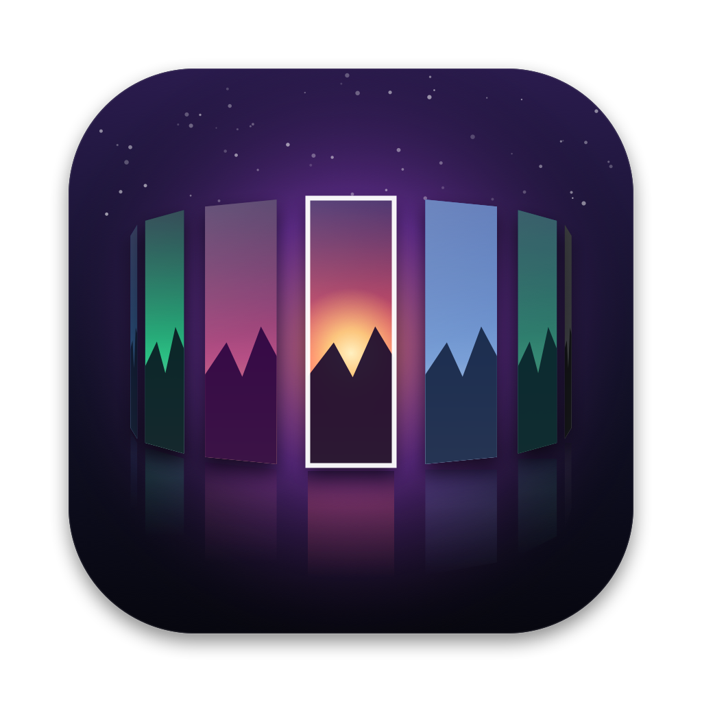
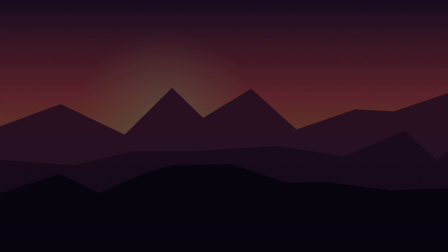

<p align="center"></p>

# WallpaperLauncher

A keyboard-driven wallpaper picker for macOS, inspired by the rofi / waypaper style launchers common on Arch and other Linux setups.

Press a global hotkey, your wallpapers appear on a rotating 3D ring over a live preview, pick one, hit Enter — done.

<p align="center"></p>

## Features

**Picking**
- **Global hotkey** (default `⌃⌥W`, configurable) toggles the launcher from anywhere
- **Three layouts:** rotating 3D ring, cover-flow carousel, or a rofi-style grid
- **Live preview:** the selected wallpaper fills the screen behind the cards while you browse
- **Folder tabs:** switch between all wallpapers, favorites and each folder with `↑` `↓`
- **Favorites** (`⌘F`), type-to-search, keyboard, trackpad and scroll wheel navigation
- **Accent color** of the launcher follows the current wallpaper

**Applying**
- **Different wallpapers per display:** pick the target display in the launcher (`⌘D`, `⌘1`–`⌘9`)
- **All Spaces at once:** the chosen wallpaper is re-applied when you switch Spaces
- **Light/dark pairs:** `name-light.jpg` / `name-dark.jpg` switch with the system appearance
- **Live wallpapers:** MP4/MOV videos and animated GIFs play muted behind your desktop icons

**Automation**
- **Change every** 5 minutes … 1 day, shuffled or in order, from all wallpapers or favorites only
- **Time of day:** different wallpapers (or folders) for morning, day, evening and night
- **Color schemes like pywal:** exports a 16-color palette for kitty, Ghostty, Alacritty, Xresources, CSS and shell scripts
- **Hook:** runs your own shell command after every change

**Getting wallpapers**
- **Online browser** for [Wallhaven](https://wallhaven.cc) (search, top, hot, latest, random — SFW only) and the Bing image of the day
- **Drag & drop** images, videos or image links onto the menu bar icon to add and apply them

**App**
- Menu bar app (no Dock icon), settings window, built-in **auto-update** from GitHub releases
- Supports JPG, PNG, HEIC, WebP, TIFF, GIF, BMP, MP4, MOV and M4V

## Download

Grab `WallpaperLauncher-<version>.zip` from the [latest release](https://github.com/witti02/wallpaper-launcher/releases/latest), unzip it and move **WallpaperLauncher.app** to `/Applications` or `~/Applications`. It runs on Apple silicon and Intel Macs with macOS 14 or later. Later versions install themselves via **Check for Updates…**.

The app is not notarized by Apple, so macOS blocks it on first launch. To open it anyway, either:

- open it once, then go to **System Settings → Privacy & Security** and click **Open Anyway**, or
- remove the quarantine flag in Terminal:

  ```bash
  xattr -dr com.apple.quarantine /Applications/WallpaperLauncher.app
  ```

## Usage

| Key | Action |
|---|---|
| `⌃⌥W` (global) | Open / close the launcher |
| type | Search wallpapers |
| `←` `→` / `Tab` / scroll | Select (rotate the ring) |
| `↑` `↓` | Switch folder tab (in the grid: move by row, `⌥↑` `⌥↓` switches tabs) |
| `↩` or double-click | Apply wallpaper |
| `⇧↩` | Apply and keep the launcher open |
| `⌘F` | Add / remove favorite |
| `⌘D` / `⌘1`–`⌘9` | Choose the display to apply to |
| `⌘S` | Switch layout (ring, carousel, grid) |
| `⌘G` | Get wallpapers online |
| `⌘R` | Apply a random wallpaper |
| `⌘,` | Open settings |
| `esc` | Clear search, then close |

The menu bar icon also offers **Next Wallpaper**, **Random Wallpaper**, **Get Wallpapers…**, **Check for Updates…** and accepts dropped images.

### Settings

Open them from the menu bar icon → **Settings…** or with `⌘,` while the launcher is open. Changes apply immediately.

| Tab | Options |
|---|---|
| **General** | shortcut, target displays, scaling, close after applying, all Spaces, light/dark pairs, GIF animation, pause videos on battery, launch at login, automatic updates |
| **Folders** | add, remove and disable folders, subfolders per folder, file types, sort order, download folder, favorites |
| **Appearance** | layout, live preview, blur, dimming, card shape and size, corner radius, ring spacing and radius, visible cards, animation speed, tabs, search bar and hints |
| **Automation** | rotation interval, pool and order, or a time-of-day schedule |
| **Colors** | palette of the current wallpaper, accent tint, color scheme export, command to run after every change |

By default the launcher reads `~/Pictures/Wallpaper` and saves downloads to `~/Pictures/Wallpaper/Downloads`.

### Color schemes

With **Colors → Export a color scheme** enabled, every wallpaper change writes these files to `~/.cache/wallpaper-launcher` (configurable):

`colors.json` · `colors.sh` · `colors.css` · `colors.Xresources` · `colors-kitty.conf` · `colors-ghostty` · `colors-alacritty.toml`

For example, add `include ~/.cache/wallpaper-launcher/colors-kitty.conf` to your kitty config and set the post-change command to `kitty +kitten themes --reload-in=all` (or any script). The command runs in zsh with `$WALLPAPER` and `$WALLPAPER_COLORS` set.

### Scripting

```bash
open -a WallpaperLauncher                                               # toggle the launcher (e.g. from skhd or Hammerspoon)
~/Applications/WallpaperLauncher.app/Contents/MacOS/WallpaperLauncher --random      # set a random wallpaper and exit
~/Applications/WallpaperLauncher.app/Contents/MacOS/WallpaperLauncher --background  # start without showing the panel
```

## Build from source

Requires macOS 14 or later and the Xcode Command Line Tools (`xcode-select --install`).

```bash
./build.sh            # builds build/WallpaperLauncher.app
./build.sh --install  # builds and copies it to ~/Applications
./build.sh --release  # universal build, zipped for distribution
open ~/Applications/WallpaperLauncher.app
```

The app is ad-hoc signed, so no developer account is needed. The icon and the demo GIF are generated:

```bash
swift Scripts/make-icon.swift Resources/AppIcon.png
build/WallpaperLauncher.app/Contents/MacOS/WallpaperLauncher --render-demo docs/demo.gif   # uses ffmpeg if installed
```

## Notes

- macOS has no API to set a wallpaper for all Spaces, so the app re-applies it when you switch to a Space that still shows an old one.
- Live wallpapers only play while the app is running; otherwise their first frame stays as a still wallpaper.
- The light background blur uses a private window server call (the same one terminal emulators use). If it ever becomes unavailable, the app falls back to a standard macOS blur.
- "Launch at Login" and auto-update require the app to live in `/Applications` or `~/Applications`.
